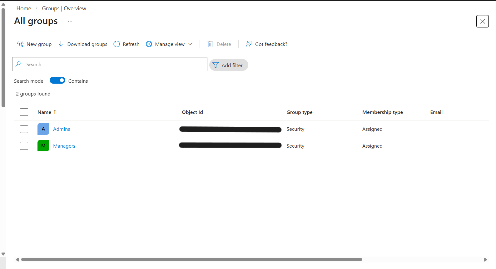
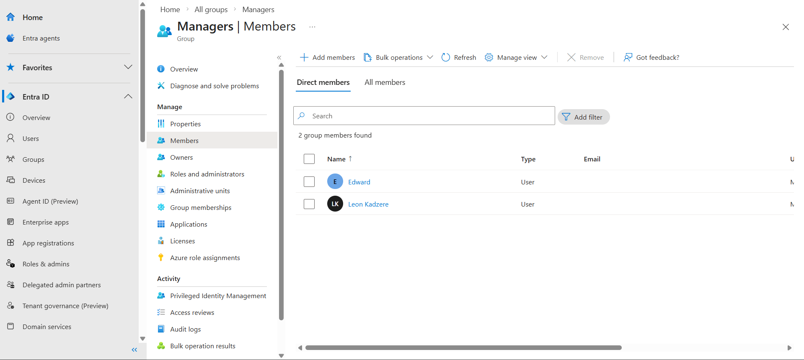

# Group Management Lab

## Objective
Create and manage groups in Microsoft Entra ID

## Tasks Completed
- Created security groups
- Added users to groups
- Configured group membership
- Verified group assignments

## Groups Created
- Admins
- Managers

## What I Learned
- How to create security groups
- Group-based access management
- Assigning users to groups
- Managing group membership

## Screenshots

### Groups List

### Group Members

