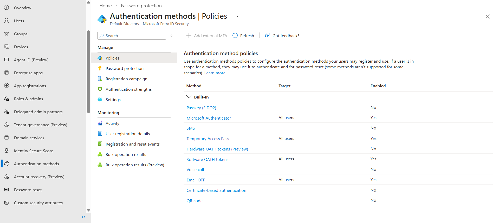
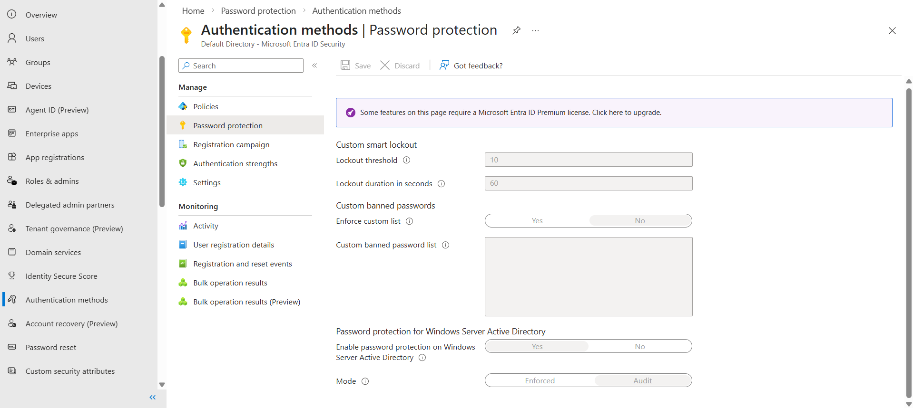
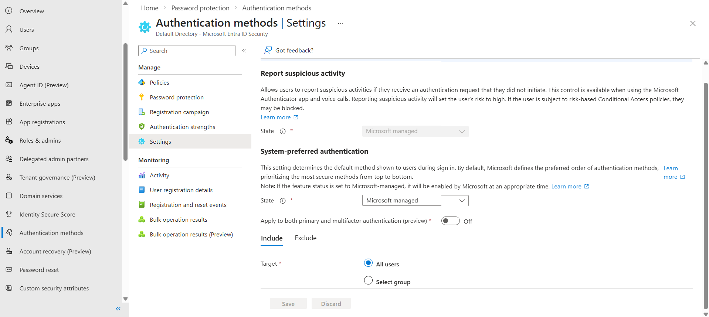

# Password Protection Lab

## Objective
Review and configure password protection policies in Microsoft Entra ID

## Tasks Completed
- Reviewed authentication methods policies
- Reviewed password protection settings
- Reviewed authentication settings
- Examined smart lockout configuration

## What I Learned
- Password protection improves identity security
- Smart lockout prevents brute-force attacks
- Authentication method policies control login security
- Password protection integrates with Microsoft Entra ID security

## Screenshots

### Authentication Methods

### Password Protection Policy

### Authentication Settings

