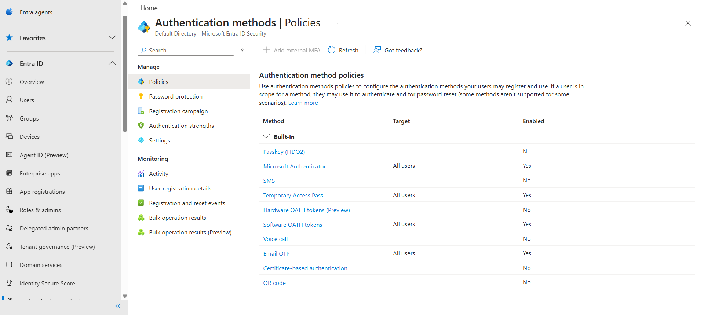
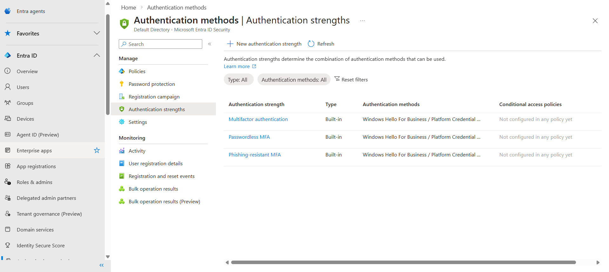

# Multi-Factor Authentication (MFA)

## Objective
Configure and review multi-factor authentication in Microsoft Entra ID

## Tasks Completed
- Reviewed authentication method policies
- Reviewed authentication strengths
- Verified MFA configuration options

## What I Learned
- MFA improves identity security
- Multiple authentication methods available
- Authentication strengths improve protection

## Screenshots

### MFA Authentication Methods

### Authentication Strengths

