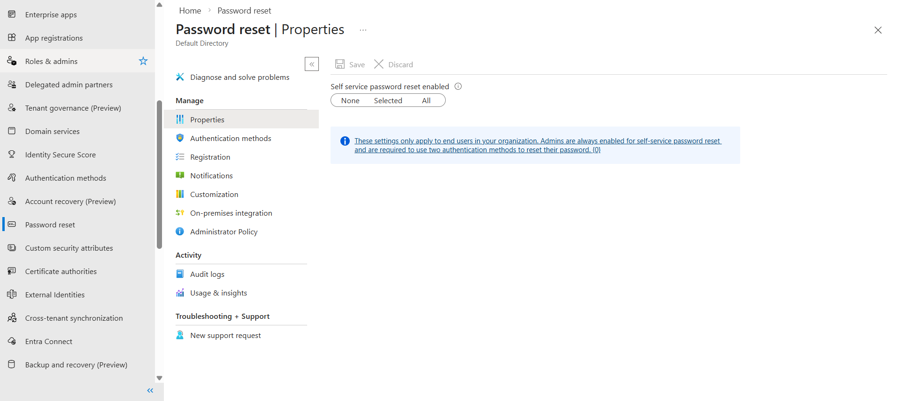
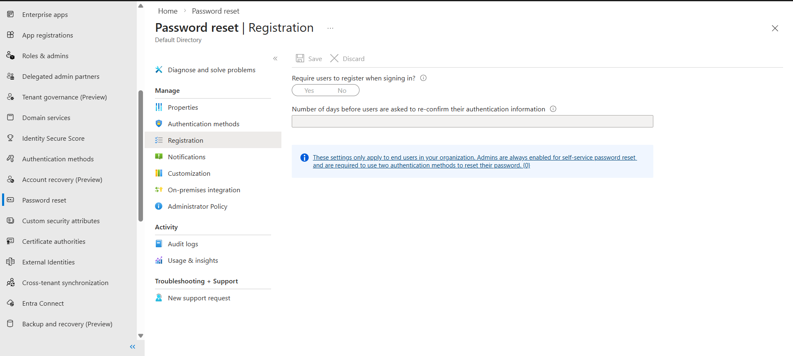

# Self-Service Password Reset (SSPR)

## Objective
Configure and review Self-Service Password Reset in Microsoft Entra ID

## Tasks Completed
- Reviewed SSPR enablement
- Configured authentication methods
- Reviewed registration settings

## What I Learned
- SSPR reduces helpdesk workload
- Multiple authentication methods improve security
- Registration ensures users can reset passwords securely

## Screenshots

### SSPR Enabled

### Registration Settings

