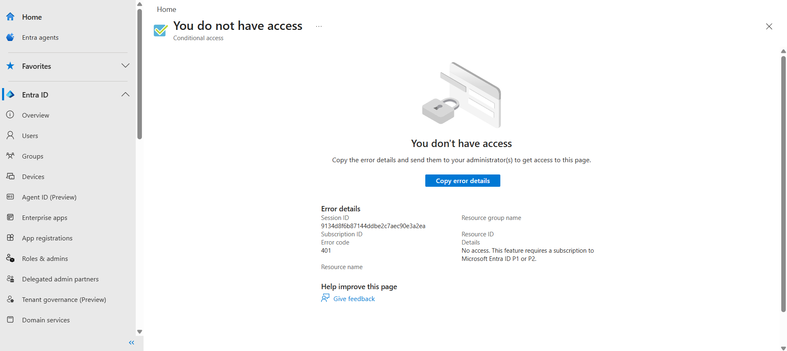

# Conditional Access

## Objective
Review and plan Conditional Access policies in Microsoft Entra ID

## Tasks Completed
- Navigated to Conditional Access configuration
- Reviewed licensing requirements
- Designed Conditional Access policy scenarios

## Planned Policies
- Require MFA for all users
- Block legacy authentication
- Require compliant device for admin access

## What I Learned
- Conditional Access requires Microsoft Entra ID P1 or P2
- Conditional Access is central to identity security
- Policies can control access based on conditions and signals

## Screenshots

### Conditional Access License Requirement

